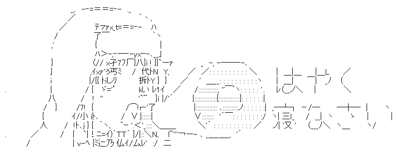

<div align="center">
  
  
  # index-chan
  
  [日本語](README.ja.md) | [English](README.md)
  
  [](https://opensource.org/licenses/MIT)
  [](https://www.rust-lang.org/)
  
  記憶を持つ司書 - コード検索と会話グラフ（Phase 2完了）
</div>

## 概要

**現在の機能（Phase 2完了 v0.2.0）:**
index-chanは、TypeScriptプロジェクトのデッドコード検出、コード検索、会話履歴分析を統合したCLIツールです。

**主な機能:**
├─ デッドコード検出と削除（Phase 1）
├─ LLM統合による高精度分析（Phase 1.5）
├─ コード検索（ベクトル検索）（Phase 2）
└─ 会話グラフと関連メッセージ検索（Phase 2）

**将来のビジョン:**
最終的には、依存グラフとベクトル検索を組み合わせた「コード依存グラフ型検索システム」を目指しています。LLMが正確なコンテキストでコードを理解・編集できるようにする次世代の開発支援ツールです。詳細は[docs/VISION.ja.md](docs/VISION.ja.md)を参照してください。

## 機能

### Phase 1: デッドコード検出 ✅
- TypeScriptのAST解析
- 関数呼び出しの依存グラフ構築
- 未使用関数・クラスの検出
- 安全性レベル評価（確実に安全/おそらく安全/要確認）
- 削除機能（対話的/自動）
- アノテーション機能（警告抑制コメント自動追加）

### Phase 1.5: LLM統合 ✅
- Qwen2.5-Coder-1.5Bによる高精度分析
- 「将来使う予定」の自動検出
- 実験的機能・WIPの識別
- 完全ローカル実行（プライバシー保護）
- 意味のある日本語応答を生成

### Phase 2: 検索 + 会話グラフ ✅
- **コード検索**: ベクトル検索によるセマンティック検索
- **会話グラフ**: 会話履歴のグラフ化とトピック検出
- **関連メッセージ検索**: 過去の会話から関連部分を抽出
- **トークン削減**: 39.5〜60%のコンテキスト削減
- **LLMトピック検出**: 高精度なトピック分類

## インストール

```bash
cargo install --path .
```

## 使い方

### スキャン（検出のみ）

```bash
# 基本的なスキャン
index-chan scan <directory>

# JSON出力
index-chan scan <directory> --output report.json

# LLM分析モード（Phase 1.5 ✅）
index-chan scan <directory> --llm
```

### 削除（対話的）

```bash
# 対話的に確認しながら削除
index-chan clean <directory>
```

### 削除（自動、確実に安全なもののみ）

```bash
# 確実に安全なもののみ自動削除
index-chan clean <directory> --auto --safe-only
```

### ドライラン

```bash
# 実際には削除せず、動作確認のみ
index-chan clean <directory> --dry-run
```

### アノテーション追加

```bash
# 「将来使う予定」のコードに警告抑制アノテーションを追加
index-chan annotate <directory>

# ドライラン
index-chan annotate <directory> --dry-run

# LLM分析モード（高精度）
index-chan annotate <directory> --llm
```

### グラフエクスポート（Phase 3.1 ✅）

```bash
# GraphML形式（Gephi、yEd、Cytoscapeで開ける）
index-chan export <directory> -o graph.graphml -f graphml

# DOT形式（Graphvizで可視化）
index-chan export <directory> -o graph.dot -f dot

# JSON形式（カスタム可視化用）
index-chan export <directory> -o graph.json -f json
```

**Graphvizでの可視化:**
```bash
# SVG出力
dot -Tsvg graph.dot -o graph.svg

# PNG出力（3Dレイアウト）
neato -Tpng graph.dot -o graph.png
```

### 3D Web可視化（Phase 3.2 ✅）

```bash
# Web機能を有効にしてビルド
cargo build --features web --release

# Webサーバー起動
cargo run --features web --release -- visualize <directory> --port 8080

# ブラウザ自動起動
cargo run --features web --release -- visualize <directory> --port 8080 --open
```

**機能:**
- Three.js + force-graph-3dによるインタラクティブ3Dグラフ
- リアルタイム統計（ノード数、エッジ数、未使用数）
- ノードクリックで詳細表示
- カメラ操作（回転、ズーム、パン）
- ダークテーマUI

**ブラウザで開く:** http://localhost:8080

### データベース層（Phase 4 ✅）

**Phase 4.0: 基礎機能**
```bash
# DB機能を有効にしてビルド
cargo build --features db --release

# プロジェクト初期化
cargo run --features db --release -- init <directory>

# 統計表示
cargo run --features db --release -- stats <directory>

# ファイル監視（リアルタイム更新）
cargo run --features db --release -- watch <directory>
```

**Phase 4.1: 既存コマンドのDB統合**
```bash
# DBから高速スキャン
cargo run --features db --release -- scan <directory> --use-db

# DBから高速エクスポート
cargo run --features db --release -- export <directory> -o graph.json -f json --use-db

# DBから高速可視化
cargo run --features db,web --release -- visualize <directory> --use-db
```

**機能:**
- SQLiteによる永続化
- ファイルハッシュベースの変更検知
- リアルタイムファイル監視
- 自動データベース更新
- プロジェクト統計
- 既存コマンドのDB対応（再スキャン不要）

**理想的なワークフロー:**
```bash
# 1. プロジェクト初期化（一度だけ）
$ cargo run --features db --release -- init test_project

🔧 プロジェクトを初期化中: test_project
✅ セットアップ完了！

📊 プロジェクト統計:
  ファイル数: 2
  関数数: 13
  依存関係: 1
  デッドコード: 13 個 (100.0%)

# 2. ファイル監視開始（バックグラウンド）
$ cargo run --features db --release -- watch test_project

👀 ファイル監視を開始: test_project
✅ 監視開始（Ctrl+Cで終了）

[23:38:20] 🔄 変更: sample.ts
   ✅ データベースを更新

[23:38:34] 📄 追加: new_file.ts
   ✅ データベースを更新

# 3. 高速スキャン（DBから、再スキャン不要）
$ cargo run --features db --release -- scan test_project --use-db

💾 Using database
📂 データベースから読み込み中...
🗑️  Unused Functions: 11 (38 lines)

# 4. 統計確認
$ cargo run --features db --release -- stats test_project

📊 プロジェクト統計: test_project
  ファイル数: 3
  関数数: 15
  デッドコード: 15 個 (100.0%)

# 5. 高速エクスポート（DBから）
$ cargo run --features db --release -- export test_project -o graph.json -f json --use-db

💾 Using database
✅ JSON形式でエクスポート完了
```

**特徴:**
- 一度initすれば、あとは自動で追跡
- watchが変更を検知して自動更新
- すべてのコマンドが--use-dbで高速化
- 再スキャン不要

## LLMモード（Phase 1.5）

### 概要

LLMモードでは、Qwen2.5-Coder-1.5Bを使用して高精度な分析を行います。

**特徴**
- 完全ローカル実行（コードが外部に送信されない）
- 「将来使う予定」「実験的機能」「WIP」の自動検出
- Git履歴を考慮した判断
- 確信度スコア付き

### 推論テスト

```bash
# トークナイザーのみテスト
cargo run --release -- test-llm --tokenizer-only

# 推論テスト（デフォルトプロンプト）
cargo run --release -- test-llm

# カスタムプロンプトでテスト
cargo run --release -- test-llm --prompt "このコードにバグはありますか？"

# 実際の出力例
🤖 LLM推論テスト開始

📝 プロンプト:
この関数は削除しても安全ですか？

function unusedHelper() {
  return 42;
}

✅ 推論成功！

📤 応答:
この関数は削除しても安全です。JavaScript では、関数はスコープ内に存在し、
関数の定義はそのスコープの外に存在します。つまり、関数はスコープ外
```

### 実際のプロジェクトでの使用

```bash
# 初回起動（モデルダウンロード、約3GB）
cargo run -- scan test_project --llm

# 出力例
🔍 Scanning directory: test_project
🤖 LLM分析モード有効

📥 初回起動: Qwen2.5-Coder-1.5Bをダウンロード中...
✅ モデル読み込み完了

🤖 LLMで分析中...
✅ LLM分析完了

[削除推奨] 8個（確信度 95%以上）
├─ oldAuthMethod: 2年前に作成、新実装に置き換え済み (確信度: 95%)
└─ deprecatedHelper: コミットログに「deprecated」と記載 (確信度: 98%)

[保持推奨] 4個（確信度 85%以上）
├─ futureFeature: 1週間前に追加、WIP状態 (確信度: 90%)
└─ experimentalAI: 実験的機能、issue #123で議論中 (確信度: 88%)
```

### LLMアノテーション

```bash
# LLMで分析して自動アノテーション
index-chan annotate test_project --llm

# 結果（TypeScriptの例）
// @ts-ignore - index-chan: 実験的機能、issue #123で議論中
function experimentalFeature() {
    // ...
}
```

## Phase 2の新機能

### コード検索

```bash
# インデックス作成
index-chan index ./src

# コード検索
index-chan search "authentication" --context -k 5

# 出力例
🔍 Searching: authentication
📊 Found 5 results:

1. authenticateUser (score: 0.92)
   📄 src/auth.ts:45:78
   📝 Code:
      function authenticateUser(username, password) {
        return checkCredentials(username, password);
      }
```

### 会話履歴の分析

```bash
# トピック抽出（キーワードベース）
index-chan topics chat_history.json

# 出力例
📚 トピック抽出: chat_history.json

📊 5個のトピックを検出:

1. デッドコード検出 (4 messages)
   キーワード: デッドコード, 検出, 削除

2. データベース接続エラー (4 messages)
   キーワード: データベース, 接続, エラー

# LLMによる高精度トピック検出
index-chan topics chat_history.json --llm

# 出力例
🤖 LLM分析モード有効
📊 3個のトピックを検出:

1. TypeScriptデッドコード検出とクリーンアップ
   メッセージ数: 4
   キーワード: デッドコード, 検出, 削除, LLM分析
```

### 関連メッセージ検索

```bash
# 関連メッセージを検索
index-chan related chat_history.json "エラー" -k 3 --context

# 出力例
🔍 関連メッセージ検索: chat_history.json
📝 クエリ: エラー

📊 3件の関連メッセージを発見:

1. [user] 2024-12-02T10:15:00Z (類似度: 0.850)
   💬 データベース接続エラーが出ています
   📖 コンテキスト:
      [assistant] 接続文字列を確認してください

🎯 トークン削減効果:
  全体トークン数: 233
  関連トークン数: 141
  削減率: 39.5%
```

### Embeddingモデルのテスト

```bash
# 基本テスト
index-chan test-embedding

# 類似度比較テスト
index-chan test-embedding --compare

# 出力例
🧪 Embeddingモデルのテスト

📊 類似度比較テスト:

テキスト1: function authenticate(user, password) { return true; }
テキスト2: function login(username, pwd) { return checkCredentials(username, pwd); }
テキスト3: function calculateTotal(items) { return items.reduce(...); }

📈 類似度スコア:
  テキスト1 vs テキスト2 (認証関連): 0.8542
  テキスト1 vs テキスト3 (異なる機能): 0.3214
  テキスト2 vs テキスト3 (異なる機能): 0.2987

💡 期待される結果:
  - 認証関連の関数同士（1 vs 2）の類似度が高い
  - 異なる機能の関数（1 vs 3, 2 vs 3）の類似度が低い
```

### システム要件

**LLMモード使用時**
- メモリ: 3GB以上推奨
- ディスク: 3GB以上（モデルキャッシュ）
- 初回ダウンロード: 約3GB
- 推論速度: 約2秒/関数（CPU）

**通常モード**
- メモリ: 数十MB
- ディスク: 数MB

## 開発状況とロードマップ

### 現在の位置: Phase 2（検索 + 会話グラフ基礎）進行中 🚧

このプロジェクトは段階的に開発されています：

**Phase 1: デッドコード検出CLI** ✅ 完了
- TypeScript解析と依存グラフ構築
- 未使用コードの検出と削除

**Phase 1.5: LLM統合** ✅ 完了
- ローカルLLMによる高精度分析
- 「将来使う予定」のコード識別

**Phase 2: 検索 + 会話グラフ基礎** ✅ 完了
- ベクトル検索によるコード検索
- 会話グラフによるチャット履歴分析
- 関連メッセージ検索
- トークン削減（39.5〜60%達成）

**Phase 3: 3D依存関係グラフ可視化** ✅ 完了
- Phase 3.1: グラフエクスポート ✅ 完了
  - GraphML/DOT/JSON形式対応
  - Gephi、Graphviz等で可視化可能
- Phase 3.2: Web可視化 ✅ 完了
  - Three.js + force-graph-3dによる3D表示
  - インタラクティブな操作
  - リアルタイム統計表示

**Phase 4: データベース層 + 自動追跡** 🚧 進行中
- データベース層の基礎 ✅ 完了
  - SQLiteによる状態管理
  - ファイルハッシュベースの変更検知
  - 依存関係の永続化
- initコマンド（計画中）
  - プロジェクト初期化
  - 自動言語検出
- ファイルウォッチャー（計画中）
  - リアルタイム変更追跡
  - 差分更新

詳細なビジョンは[docs/VISION.ja.md](docs/VISION.ja.md)を参照してください。

### Phase 1 完了項目 ✅
- [x] TypeScript解析（tree-sitter）
- [x] 依存グラフ構築
- [x] デッドコード検出
- [x] 削除機能（対話的/自動）
- [x] アノテーション機能

### Phase 1.5 完了項目 ✅
- [x] LLM統合（Qwen2.5-Coder-1.5B）
- [x] ローカル推論
- [x] コンテキスト収集（Git履歴）
- [x] 高精度分析

### Phase 2 完了 ✅
- [x] ベクトル検索基盤（Week 1）
- [x] 会話グラフ基盤（Week 1）
- [x] CLI統合（Week 1）
- [x] Embeddingモデル統合（Week 2）
  - CandleによるBERTモデル実装
  - Mean pooling + L2正規化
  - フォールバックモード（シンプルハッシュ）
  - test-embeddingコマンド実装
- [x] トピック検出の改善（Week 3）
  - LLMによる高精度トピック推定
  - 日本語キーワード抽出改善
  - CLI統合（--llmオプション）
- [x] 関連会話抽出（Week 4）
  - セマンティック検索による関連メッセージ抽出
  - コンテキストウィンドウ機能
  - トークン削減計算（39.5〜60%達成）
  - 警告の完全修正
- [ ] Python対応（Week 11-12）
- [ ] VSCode拡張（オプション）
- [ ] プロンプトの最適化
- [ ] エラーハンドリングの改善

### Phase 3 完了項目 ✅
- [x] Phase 3.1: グラフエクスポート
  - [x] GraphML形式出力
  - [x] DOT形式出力（Graphviz互換）
  - [x] JSON形式出力
  - [x] 無効エッジのフィルタリング
- [x] Phase 3.2: Web可視化
  - [x] axum Webサーバー
  - [x] Three.js + force-graph-3d統合
  - [x] インタラクティブUI
  - [x] リアルタイム統計表示
  - [x] ノード詳細パネル
  - [x] ダークテーマUI

### Phase 3 計画
- [ ] Phase 3.3: Tauriデスクトップアプリ
  - [ ] スタンドアロンGUI
  - [ ] リアルタイム更新
  - [ ] ファイルウォッチャー
  - [ ] 設定の永続化
  - [ ] 複数プロジェクト管理

### 将来の計画（多言語対応）
- [ ] Rust, Python, Go, Java対応
- [ ] 高度な依存関係解析
- [ ] インクリメンタル更新

## テスト

```bash
# サンプルプロジェクトでテスト
cargo run -- scan test_project

# JSON出力
cargo run -- scan test_project --output report.json
```

## 免責事項

**このプロジェクトを使用する前に[DISCLAIMER.md](DISCLAIMER.md)を必ずお読みください。**

これは個人の実験的プロジェクトです。作者はプロフェッショナルなプログラマではなく、プロフェッショナルなサポートを提供できません。

## ライセンス

MIT License

## 注意事項

⚠️ **重要な免責事項**

**このプロジェクトは個人の実験的プロジェクトです。**

- 作者はプロフェッショナルなプログラマではありません
- Phase 1.5（LLM統合）が完了したばかりで、まだ不安定です
- 本番環境での使用は推奨しません
- バグや問題が含まれている可能性が高いです
- サポートは限定的です（質問に答えられない場合があります）
- 使用は自己責任でお願いします

**貢献について:**
- バグ報告は歓迎しますが、即座の対応は保証できません
- このプロジェクトは学習・実験目的で作成されています

## ドキュメント

- [docs/](docs/): 設計書・企画書（英語）
- [Doc/](Doc/): 開発メモ・調査資料（日本語、非公開）

## 貢献

現在は個人開発中ですが、Issue・PRは歓迎します。

